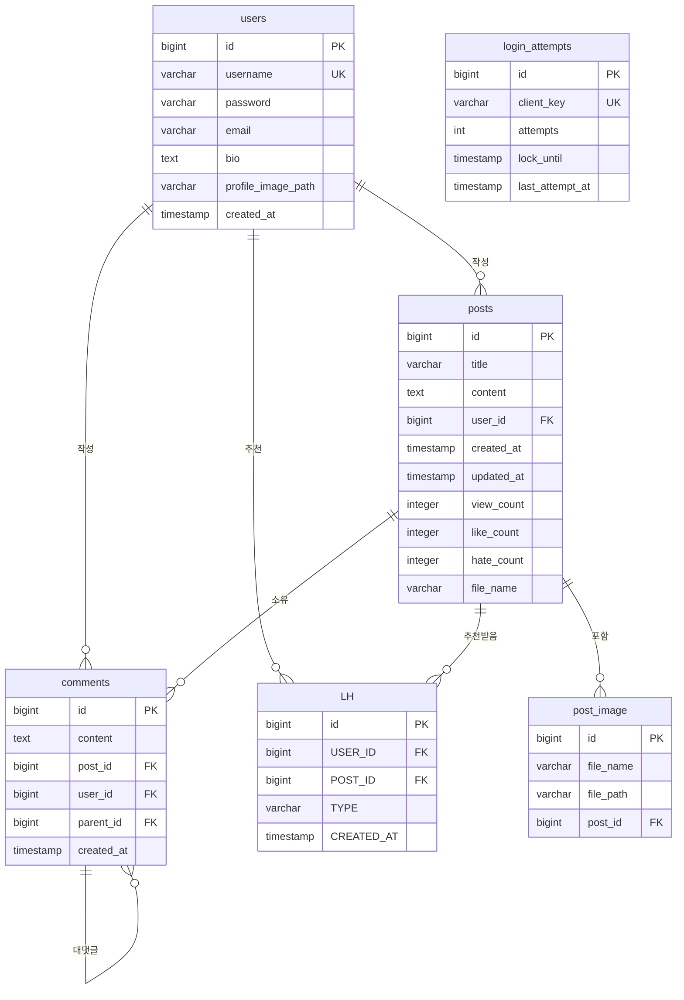

# STARLOG Database Guide

## Environment Overview

| 환경 | DBMS | 연결 URL | DDL |
|------|------|----------|-----|
| **dev** (기본) | H2 (파일) | `jdbc:h2:file:~/starlog-db/db-dev;AUTO_SERVER=TRUE` | `update` (자동) |
| **prod** | MySQL 8 | `jdbc:mysql://localhost:3306/starlog` | `validate` (수동) |

운영 DB는 `ddl-auto=validate`로 되어 있어 테이블이 자동 생성되지 않습니다. 최초 배포 시 `update`로 변경 후 실행해야 합니다.

---

## Entity Relationship Diagram

```
┌──────────────────────────┐
│         users            │
├──────────────────────────┤
│ id              (PK) │◄────┐
│ username    (UK, NOT NULL)│    │
│ password       (NOT NULL) │    │
│ email          (NOT NULL) │    │
│ bio              (TEXT)   │    │
│ profile_image_path        │    │
│ created_at     (NOT NULL) │    │
└──────────────────────────┘    │
         │                      │
         │ 1                    │ 1
         │                      │
         ▼                      │
┌──────────────────────────┐    │
│         posts             │    │
├──────────────────────────┤    │
│ id              (PK) │◄──┼────┤
│ title     (NOT NULL)     │    │
│ content   (TEXT, NOT NULL)│    │
│ user_id     (FK) ────────┘    │
│ created_at   (NOT NULL)       │
│ updated_at                    │
│ view_count         (default 0)│
│ like_count         (default 0)│
│ hate_count         (default 0)│
│ file_name                    │
│ ───────────────────────       │
│ images  (1:N → PostImage)     │
│ likesHates (1:N → LH)        │
│ comments (1:N → Comment)      │
└──────────────────────────┘    │
         │                      │
         │ 1                    │ 1
         │                      │
         ▼                      │
┌──────────────────────────┐    │
│      post_image           │    │
├──────────────────────────┤    │
│ id              (PK)         │
│ file_name                   │
│ file_path                   │
│ post_id    (FK) ─────────────┘
└──────────────────────────┘


┌──────────────────────────┐
│         comments          │
├──────────────────────────┤
│ id              (PK) │◄────┐
│ content   (TEXT, NOT NULL)│    │
│ post_id     (FK) ─────────┼────┤
│ user_id     (FK) ─────────┼──┐ │
│ parent_id   (FK, self) ───┼──┼─┤
│ created_at   (NOT NULL)   │  │ │
└──────────────────────────┘  │ │ │
         ▲                    │ │ │
         │ 0..1               │ │ │
         └────────────────────┘ │ │
                                │ │
┌──────────────────────────┐    │ │
│          LH               │    │ │
├──────────────────────────┤    │ │
│ id              (PK)         │ │
│ USER_ID     (FK) ────────────┘ │
│ POST_ID     (FK) ──────────────┘
│ TYPE    ('L' | 'H', NOT NULL)  │
│ CREATED_AT                     │
└──────────────────────────┘

┌──────────────────────────┐
│     login_attempts        │
├──────────────────────────┤
│ id              (PK)         │
│ client_key (UK, NOT NULL)    │
│ attempts       (NOT NULL)    │
│ lock_until                   │
│ last_attempt_at (NOT NULL)   │
└──────────────────────────┘
```

---

## Entity Details

### 1. User (`users`)

| 컬럼 | 타입 | 제약 | 설명 |
|------|------|------|------|
| `id` | `BIGINT` | PK, Auto-Increment | 사용자 식별자 |
| `username` | `VARCHAR(50)` | **UNIQUE**, NOT NULL | 로그인 ID |
| `password` | `VARCHAR(255)` | NOT NULL | BCrypt 해시 |
| `email` | `VARCHAR(100)` | NOT NULL | 이메일 |
| `bio` | `TEXT` | nullable | 자기소개 |
| `profile_image_path` | `VARCHAR(255)` | nullable | 프로필 이미지 경로 |
| `created_at` | `TIMESTAMP` | NOT NULL, updatable=false | 가입일 |

**Repository:** `UserRepository`
- `existsByUsername(String)` — 중복 체크
- `findByUsername(String)` → `Optional<User>` — 로그인/조회
- `existsByEmail(String)` — 이메일 중복 체크

**관계:**
- `1 : N` → `Post` (`user_id`)
- `1 : N` → `Comment` (`user_id`)
- `1 : N` → `LH` (`USER_ID`)

---

### 2. Post (`posts`)

| 컬럼 | 타입 | 제약 | 설명 |
|------|------|------|------|
| `id` | `BIGINT` | PK, Auto-Increment | 게시글 ID |
| `title` | `VARCHAR(200)` | NOT NULL | 제목 |
| `content` | `TEXT` | NOT NULL | 본문 (HTML 포함 가능) |
| `user_id` | `BIGINT` | FK → `users.id`, NOT NULL | 작성자 |
| `created_at` | `TIMESTAMP` | NOT NULL, updatable=false | 작성일 |
| `updated_at` | `TIMESTAMP` | nullable | 수정일 |
| `view_count` | `INTEGER` | default 0 | 조회수 |
| `like_count` | `INTEGER` | default 0 | 좋아요 수 (denormalized) |
| `hate_count` | `INTEGER` | default 0 | 싫어요 수 (denormalized) |
| `file_name` | `VARCHAR(255)` | nullable | 첨부파일명 |

**Denormalized Counters:** `like_count`, `hate_count`는 `LH` 테이블의 실제 데이터와 별도로 게시글에 캐시됩니다. 추천/비추천 시 `Post.updateLikeCount()`, `Post.updateHateCount()`로 증감합니다.

**Repository:** `PostRepository`
- `findAllByOrderByCreatedAtDesc()` — 전체 최신순
- `findByUserOrderByCreatedAtDesc(User)` — 특정 사용자 글
- `findByTitleContainingOrContentContainingOrderByCreatedAtDesc(kw1, kw2)` — 키워드 검색
- `findAllByOrderByLikeCountDescCreatedAtAsc(Pageable)` — 인기순
- `findByCreatedAtAfterOrderByCreatedAtDesc(LocalDateTime)` — 실시간 업데이트
- `countByUser(User)` — 작성글 수
- 페이지네이션 지원 (`Pageable`)

**관계:**
- `N : 1` → `User` (`user_id`)
- `1 : N` → `PostImage` (`post_id`, cascade ALL, orphanRemoval)
- `1 : N` → `LH` (`POST_ID`, cascade ALL, orphanRemoval)
- `1 : N` → `Comment` (`post_id`, cascade ALL, orphanRemoval)

---

### 3. PostImage (`post_image`)

| 컬럼 | 타입 | 제약 | 설명 |
|------|------|------|------|
| `id` | `BIGINT` | PK, Auto-Increment | 이미지 ID |
| `file_name` | `VARCHAR(255)` | nullable | 서버 저장 파일명 |
| `file_path` | `VARCHAR(255)` | nullable | 브라우저 접근 경로 |
| `post_id` | `BIGINT` | FK → `posts.id` | 소속 게시글 |

**관계:**
- `N : 1` → `Post` (`post_id`)

---

### 4. Comment (`comments`)

| 컬럼 | 타입 | 제약 | 설명 |
|------|------|------|------|
| `id` | `BIGINT` | PK, Auto-Increment | 댓글 ID |
| `content` | `TEXT` | NOT NULL | 댓글 내용 |
| `post_id` | `BIGINT` | FK → `posts.id`, NOT NULL | 소속 게시글 |
| `user_id` | `BIGINT` | FK → `users.id`, NOT NULL | 작성자 |
| `parent_id` | `BIGINT` | FK → `comments.id`, nullable | 부모 댓글 (대댓글) |
| `created_at` | `TIMESTAMP` | NOT NULL, updatable=false | 작성일 |

**대댓글 구조:** `parent_id`가 자기참조(self-referencing) FK입니다.
- `parent_id IS NULL` — 최상위 댓글
- `parent_id = {id}` — 특정 댓글의 대댓글

**Repository:** `CommentRepository`
- `findByPostIdOrderByCreatedAtAsc(Long postId)` — 게시글의 댓글 목록
- `deleteByUser(User)` — 회원 탈퇴 시 댓글 일괄 삭제

**관계:**
- `N : 1` → `Post` (`post_id`)
- `N : 1` → `User` (`user_id`)
- `N : 1` → `Comment.parent` (self, `parent_id`)
- `1 : N` → `Comment.children` (self, mappedBy parent)

---

### 5. LH (`LH` — Like/Hate)

| 컬럼 | 타입 | 제약 | 설명 |
|------|------|------|------|
| `id` | `BIGINT` | PK, Auto-Increment | 추천식별자 |
| `USER_ID` | `BIGINT` | FK → `users.id` | 추천한 사용자 |
| `POST_ID` | `BIGINT` | FK → `posts.id` | 대상 게시글 |
| `TYPE` | `VARCHAR(1)` | `'L'` 또는 `'H'` (Enum `RecommendationType`) | Like / Hate |
| `CREATED_AT` | `TIMESTAMP` | | 생성일 |

**RecommendationType Enum:**
```java
public enum RecommendationType {
    L, // Like (좋아요)
    H  // Hate (싫어요)
}
```

**토글 로직:** 사용자가 같은 게시글에 두 번 추천하면 기존 `LH` 레코드를 찾아 `changeType()`으로 타입을 바꾸거나 취소합니다. (Service 레벨에서 구현)

**Repository:** `LhRepository`
- `countByPostIdAndType(Long postId, RecommendationType type)` — 특정 게시글의 L/H 개수
- `findByUserIdAndPostId(Long userId, Long postId)` → `Optional<Lh>` — 토글 조회
- `deleteByUser(User)` — 회원 탈퇴 시 일괄 삭제

**관계:**
- `N : 1` → `User` (`USER_ID`)
- `N : 1` → `Post` (`POST_ID`)

**유니크 제약:** 별도의 `@UniqueConstraint` 없이 애플리케이션 레벨에서 `(USER_ID, POST_ID)` 조합의 단일 레코드 보장 (`findByUserIdAndPostId` → 토글)

---

### 6. LoginAttempt (`login_attempts`)

| 컬럼 | 타입 | 제약 | 설명 |
|------|------|------|------|
| `id` | `BIGINT` | PK, Auto-Increment | PK |
| `client_key` | `VARCHAR(255)` | **UNIQUE**, NOT NULL | 클라이언트 식별자 (IP + User-Agent 해시) |
| `attempts` | `INT` | NOT NULL | 누적 실패 횟수 |
| `lock_until` | `TIMESTAMP` | nullable | 잠금 해제 시간 |
| `last_attempt_at` | `TIMESTAMP` | NOT NULL | 마지막 시도 시간 |

**목적:** 무차별 로그인 대입 공격(Brute-force) 방어. 일정 횟수 이상 실패 시 `lock_until` 시간까지 로그인 차단.

**Repository:** `LoginAttemptRepository`
- `findByClientKey(String)` → `Optional<LoginAttemptEntity>`
- `deleteByClientKey(String)`
- `deleteByLastAttemptAtBefore(Instant)` — 만료된 기록 정리

---

## Relationship Summary

| 관계 | Source | Target | FK 컬럼 | 비고 |
|------|--------|--------|---------|------|
| N:1 | Post | User | `posts.user_id` | 작성자 |
| 1:N | Post | PostImage | `post_image.post_id` | Cascade ALL + orphanRemoval |
| 1:N | Post | LH | `LH.POST_ID` | Cascade ALL + orphanRemoval |
| 1:N | Post | Comment | `comments.post_id` | Cascade ALL + orphanRemoval |
| N:1 | Comment | User | `comments.user_id` | 댓글 작성자 |
| N:1 (self) | Comment | Comment | `comments.parent_id` | 대댓글 (nullable) |
| N:1 | Lh | User | `LH.USER_ID` | |
| N:1 | Lh | Post | `LH.POST_ID` | |

**Cascade 설정:** `Post`에서 `PostImage`, `LH`, `Comment`로 `CascadeType.ALL` + `orphanRemoval = true`가 설정되어 있어, 게시글 삭제 시 관련된 모든 이미지/추천/댓글이 함께 삭제됩니다.

---

## Environment Configuration Comparison

| 항목 | dev (H2) | prod (MySQL) |
|------|----------|--------------|
| JDBC URL | `jdbc:h2:file:~/starlog-db/db-dev` | `jdbc:mysql://localhost:3306/starlog` |
| DB 종류 | H2 2.x | MySQL 8 |
| Dialect | `H2Dialect` | `MySQLDialect` |
| DDL | `update` (자동 생성) | `validate` (수동) |
| SQL 로그 | `show-sql=true`, `format_sql=true` | `show-sql=false` |
| 배치 | 미설정 | `batch_size=20`, `order_inserts=true`, `order_updates=true` |
| H2 Console | `enabled=true` (`/h2-console`) | `enabled=false` |
| 파일 업로드 | `~/starlog/upload/dev/` | `/home/kalpha/starlog/upload/` |
| 세션 타임아웃 | 15분 | 60분 |
| 쿠키 Secure | `false` | `true` |
| Thymeleaf 캐시 | `false` | `true` |
| 로그 레벨 | `DEBUG` | `INFO` |

---

## Indexes (JPA 자동 생성)

별도 `@Index` / `@Table(indexes = {...})` 선언은 없지만, JPA가 FK 컬럼에 대해 자동으로 인덱스를 생성합니다.

| 예상 인덱스 | 컬럼 | 이유 |
|-------------|------|------|
| `IDX_POST_USER` | `posts.user_id` | FK |
| `IDX_COMMENT_POST` | `comments.post_id` | FK (`findByPostIdOrderByCreatedAtAsc`) |
| `IDX_COMMENT_USER` | `comments.user_id` | FK |
| `IDX_COMMENT_PARENT` | `comments.parent_id` | FK (self) |
| `IDX_LH_USER` | `LH.USER_ID` | FK |
| `IDX_LH_POST` | `LH.POST_ID` | FK (`countByPostIdAndType`) |
| `IDX_IMAGE_POST` | `post_image.post_id` | FK |
| `IDX_LOGIN_CLIENT` | `login_attempts.client_key` | **UNIQUE** |

**권장 추가 인덱스 (운영):**
```sql
CREATE INDEX idx_posts_created_at ON posts(created_at DESC);
CREATE INDEX idx_comments_created_at ON comments(created_at ASC);
CREATE INDEX idx_lh_post_type ON LH(POST_ID, TYPE);
```

---

## H2 Console 접속 (dev)

- URL: `http://localhost:8090/h2-console`
- JDBC URL: `jdbc:h2:file:~/starlog-db/db-dev;AUTO_SERVER=TRUE`
- Username: `sa`
- Password: (빈 칸)

---

## ERD 다이어그램 (Mermaid)



---

## Entity Class Tree

```
entity/
├── User.java              → @Table("users")
├── Post.java              → @Table("posts")
│   ├── @OneToMany → PostImage (images)
│   ├── @OneToMany → Lh (likesHates)
│   └── @OneToMany → Comment (comments)
├── PostImage.java         → @Table("post_image")
├── Comment.java           → @Table("comments")
│   └── @ManyToOne (self) → Comment.parent (대댓글)
├── Lh.java                → @Table("LH")
├── LoginAttemptEntity.java → @Table("login_attempts")
└── RecommendationType.java → Enum { L, H }
```
